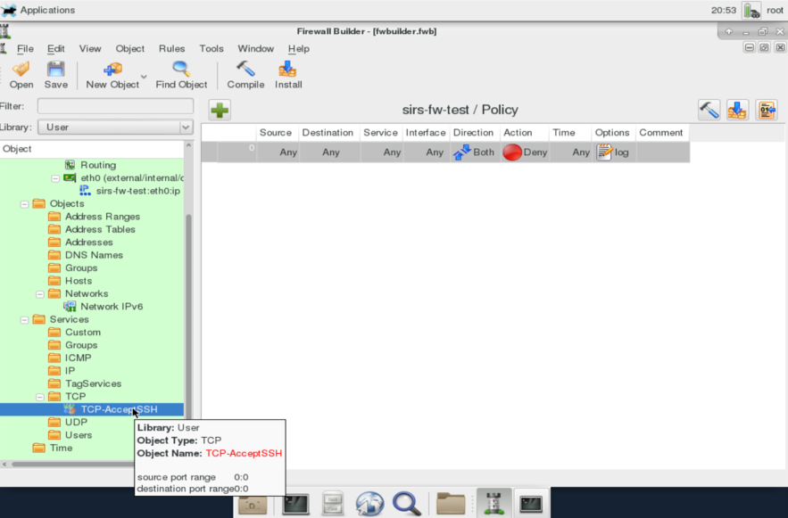

Instituto Superior Técnico, Universidade de Lisboa

**Network and Computer Security**

# Lab guide: Firewalls

## Goals

- Configure a firewall using iptables, UFW (Uncomplicated Firewall) or fwbuilder.

## 1. Introduction

This guide shows you how to configure a firewall using iptables (Section 2), UFW (Section 3) and a graphical firewall configuration tool, fwbuilder (Section 4).
The fwbuilder section is available just for reference.
The iptables and ufw section detail exactly the same firewall configurations.
Although iptables is the most established firewall configuration tool, ufw provides a simpler syntax.

This lab guide requires adapting the network setup from previous labs.
Table 1 below shows the network topology configuration for this laboratory assignment.
Based on the previous laboratory assignments of Virtual Networking and Traffic Analysis, _Initial configuration_ below on the left, the goal is to perform the necessary configuration changes to obtain the _Target configuration_ on the right.

| # Interface | Subnet | Adapter | | # Interface | Subnet | Adapter |
|:---:|:---:|:---:|:---:|:---:|:---:|:---:|
| __VM1__ |||||||
| 1 | 192.168.0.100 | enp0s3 || 1 | 192.168.0.100 | enp0s3
| __VM2__ |
| 1 | 192.168.0.10 | enp0s3 || 1 | 192.168.0.10 | enp0s3
| 2 | 192.168.1.254 | enp0s8 || 2 | 192.168.1.254 | enp0s8
| 3 | INTERNET | enp0s9 || 3 | __192.168.2.254__ | enp0s9
| __VM3__: |
| 1 | 192.168.1.1 | enp0s3 || 1 | 192.168.1.1 | enp0s3
| __VM4__: |
| 1 | 192.168.1.4 | enp0s3 || 1 | __192.168.2.4__ | enp0s3

_Table 1: Initial Configuration (from Virtual Networking and Traffic Analysis lab) on the left, and Target Configuration for this firewall lab on the right._

For that, you should proceed as follows:

- Add a new Adapter 3 (enp0s9) to VM2 and attach it to a new Internal Network _sw-3_ (or change it if you already had a 3rd adapter on VM2);
- Attach Adapter 3 to the subnet `192.168.2.0/24` and set VM2's IP address as `192.168.2.254` on that adapter's configuration;
- Attach VM4's Adapter 1 to _sw-3_;
- Attach VM4's Adapter 1 to the subnet `192.168.2.0/24` and set VM4's IP address as `192.168.2.4` on that adapter's configuration. Do not forget to change the default gateway to be `192.168.2.254`.

You should conform to your adapter names accordingly.

Please revise the previous lab assignments for instructions on how to obtain the initial configuration (left box of the table), taking into account whether you are using rnl-virt or VirtualBox.

## 2. iptables

The native firewall software in Linux is part of the kernel.
However, you can use the iptables tool (`man iptables`) to manage its rules.
All the rules below should be applied in VM2 unless it is said otherwise.

Start by flushing all existing rules (if there are any):

```sh
$ sudo /sbin/iptables -F
```

### 2.1. Simple Rules

Experiment with some simple rules in VM2.

#### 2.1.1. Reject ICMP packets

The following command adds a rule to drop all incoming ICMP packets.

```sh
$ sudo /sbin/iptables -A INPUT -p icmp -j DROP
```

This new rule can be seen by listing all rules managed by iptables:

```sh
$ sudo /sbin/iptables -L
```

Test this new rule by sending a ping from VM3 to VM2.

- Were you able to see (on VM3) the ping being performed to VM2?
- Were you able to see (on VM2) the ping from VM3? Why?
- Can you ping VM3 from VM4?
- And VM4 from VM3?

Sugestion: Use traceroute to understand how the ICMP packet is going to the destination.

Use one of the following commands to erase this rule from VM2:

```sh
$ sudo /sbin/iptables –D INPUT 1
$ sudo /sbin/iptables –D INPUT –p icmp –j DROP
```

#### 2.1.2. Ignore telnet connections

Confirm that you can establish a telnet connection to VM2 (for example, try from VM1).  
Block these connections using the following command (in VM2).

```sh
$ sudo /sbin/iptables -A INPUT -p tcp --dport 23 -j DROP
```

Check whether telnet connections to VM2 are still possible.

Delete the previous rule by executing one of the following commands:

```sh
$ sudo /sbin/iptables -D INPUT 1
$ sudo /sbin/iptables -D INPUT -p tcp --dport 23 -j DROP
```

#### 2.1.3. Ignore telnet connections from specific IP addresses

Ignore telnet connections from VM1:

```sh
$ sudo /sbin/iptables -A INPUT -p tcp -s [host address] --dport 23 -j DROP
```

Check that all machines except VM1 are able to open a telnet connection with VM2.

#### 2.1.4. Ignore telnet connections from a specific subnet

Ignore telnet connections from the subnet that includes VM4.

```sh
$ /sbin/iptables -A INPUT -p tcp -s 192.168.2.0/24 --dport 23 -j DROP
```

At this point you should not be able to open a telnet connection to VM2 from VM4.

Delete all existing rules.

```sh
$ sudo /sbin/iptables –F
```

### 2.2 Redirect connections

The previous exercises used the INPUT chain from the Filter table.
This chain affects the packets addressed to the machine where the rule is being defined.

We will now use the PREROUTING chain in the NAT table in order to redirect network packets (and perform DNAT and SNAT translations).
To list all the rules of the NAT table use:

```sh
$ sudo /sbin/iptables -t nat -L
```

Run:

```sh
$ sudo /sbin/iptables -t nat -A PREROUTING --dst 192.168.0.10 -p tcp --dport 23 -j DNAT  --to-destination 192.168.1.1
```

Make a telnet connection from VM1 to VM2.

- Are you in VM2? Run `netstat –t` command on VM2.
- Where are you then?
- Confirm that the connection was established between VM1 and VM3 using the `netstat –t` command on VM3.

In order to redirect HTTP traffic to VM3 change from port `23` to `80` on the previous iptables command.

Use a browser in VM1 and go to `http://192.168.0.10` (this is VM2's address).

- Run `netstat –t` onm VM3 to confirm that the connection is in fact between VM1 and VM3:

Delete now all existing rules:

```sh
$ sudo /sbin/iptables –F
$ sudo /sbin/iptables -t nat –F
```

## 3. UFW

The default firewall configuration tool for Ubuntu and other Linux distributions is ufw, which simplifies the use of iptables.
There is an excellent introduction to UFW at <https://help.ubuntu.com/community/UFW#UFW_-_Uncomplicated_Firewall>.

All the rules below should be applied in VM2 unless it is said otherwise.

Start by enabling UFW:

```sh
$ sudo ufw enable
```

Contrary to iptables, UFW's default configuration is the conservative option of denying all incoming connections and routing paths.
This is visible when UFW's status is checked:

```sh
$ sudo ufw status verbose
```

Although this can be a good secure starting point for a firewall configuration, in order to replicate the tests in section 2 we will start by reversing this option with the following commands:

```sh
$ sudo ufw default allow INCOMING
$ sudo ufw default allow FORWARD
```

Check that the default options have changed:

```sh
$ sudo ufw status verbose
```

### 3.1. Simple Rules

#### 3.1.1. Reject ICMP packets

By default, the folder `/etc/ufw` contains UFW's configuration files.
Below we will see other examples with simpler command line rules.
However, processing ICMP packets, in this case dropping them, requires editing the `/etc/ufw/before.rules` file.
Edit the file as root, find the following line:

```sh
-A ufw-before-input -p icmp --icmp-type echo-request -j ACCEPT
```

and replace ACCEPT with DROP.
Reload UFW by running:

```sh
$ sudo ufw reload
```

Test this new rule by sending a ping from VM3 to VM2.

- Were you able to see (on VM3) the ping being performed to VM2?
- Were you able to see (on VM2) the ping from VM3? Why not?
- Can you ping VM3 from VM4?
- And VM4 from VM3?
 
Sugestion: Use traceroute to understand how the ICMP packet is going to the destination.
Also, if you want VM2 to completely discard any ICMP packet it sees, do the same change from ACCEPT to DROP, in the following line of the same file:

```sh
-A ufw-before-forward -p icmp --icmp-type echo-request -j ACCEPT
```

Undo the change(s) to the rules file and reload UFW again.

#### 3.1.2. Ignore telnet connections

Experiment with some simple rules in VM2 to ignore telnet connections.
Confirm that you can establish a telnet connection to VM2 (for example, try from VM1).
Block these connections using the following command (in VM2).

```sh
$ sudo ufw deny telnet  
```

Check whether telnet connections to VM2 are still possible.

Delete the previous rule by running:

```sh
$ sudo ufw delete deny telnet
```

OR by listing the existing rules as a numbered list:

```sh
$ sudo ufw status numbered
```

and then you can simply deleting the one added above by its number:

```sh
$ sudo ufw delete <rule-number>
```

#### 3.1.3. Ignore telnet connections from specific IP addresses

Ignore telnet connections from VM1:

```sh
$ sudo ufw deny from 192.168.0.100 to any port telnet
```

Check that all machines except VM1 are able to open a telnet connection with VM2.

#### 3.1.4. Ignore telnet connections from a specific subnet

Ignore telnet connections from the subnet that includes VM4.

```sh
$ sudo ufw deny from 192.168.2.0/24 to any port telnet
```

At this point you should not be able to open a telnet connection to VM2 from VM4.

Delete all existing rules:

```sh
$ sudo ufw reset
$ sudo ufw enable
```

### 3.2 Redirect connections

The previous exercises used rules for incoming packets.

Let us look at how to perform NAT operations with UFW.
Let us experiment with rerouting telnet traffic <?from VM2 to VM3 ?>.
Edit `/etc/ufw/before.rules` as root and add the following at the beginning of the file (`23` is the telnet port):

```txt
# nat Table rules
*nat
:PREROUTING ACCEPT [0:0]
# Forward traffic from eth1 through eth0.
-A PREROUTING -i enp0s3 -d 192.168.0.10 -p tcp --dport 23 -j DNAT --to-destination 192.168.1.1:23
# do not delete the 'COMMIT' line or these nat table rules will not be processed
COMMIT
```

and then restart UFW:

```sh
$ sudo ufw reload
```

Make a telnet connection from VM1 to VM2.

- Are you in VM2? Run `netstat –t` command on VM2.
- Where are you then?
- Confirm that the connection was established between VM1 and VM3 using the `netstat –t` command on VM3.

In order to redirect HTTP traffic to VM3, change parameter dport from `23` to `80` in the previous `/etc/ufw/before.rules` configuration and reload UFW again.

Use a browser in VM1 and go to `http://192.168.0.10` (this is VM2's address).

- Run `netstat –t` on VM3 to confirm that the connection is in fact between VM1 and VM3:

To wrap up delete the changes made to the `before.rules` file and reload UFW again.

## 4. Fwbuilder (additional reference example)

This section introduces _fwbuilder_, which is a cross-platform firewall management software.
It should be used on VM2.
_fwbuilder_ is included only as an additional reference and as an example of a firewall manager with a GUI (Graphical User Interface).

First check if you have fwbuilder by running in the terminal:

```sh
$ fwbuilder
```

If it is not installed, install it by running:

```sh
$ sudo apt install fwbuilder
```

### 4.1. Simple rules

Run fwbuilder `$ fwbuilder` and create a new project.

#### 4.1.1. Create a new firewall

- Create new project file (_File -> Save as..._).
- The firewall will be stored in an fwbuilder `.fwb` project file.
Choose a name for the new project (e.g. `sirs-firewall`).
- Click _Save_.
- The main firewall configuration overview window should now be open.
It is titled `Firewall Builder: [firewall project name]`.
For the name suggested earlier, it will be `Firewall Builder: [sirs-firewall.fwb]`
- Click _Object -> New Object -> New Firewall_.
- Configure the new firewall with:
  - The name may be something such as `sirs-fw-test`.
  - Choose firewall software it is running: _iptables_.
  - Choose the OS (Operating System) where the new firewall will run on: _Linux 2.4/2.6_.
- Click `Next >`
- The following window should have two radio buttons with only the _Configure interfaces manually_ option selected.
- Click `Next >`
- Add the network interfaces.
The information to be given to each network interface configuration may be displayed through the command: `ifconfig`
- For each, you should fill in the following fields:
  - Name: `ethX`
  - Address: `192.168.Y.Z`
  - Netmask: `255.255.255.0`
  - Label: `external/internal/dmz`
- You should configure the interfaces in the firewall accordingly.
- Set one of the interfaces as a management interface (you may do this by right-clicking one of the interface icons in _Firewalls_ -> sirs-fw-test assuming that was the name you gave the firewall.
Choose _Edit_ in the dropdown and then check _Management Interface_ checkbox).
- Save the current project file, in case something happens.
The default location for it is the current user's home directory.

#### 4.1.2. Accept ssh connections

`fwbuilder` requires that the machine accepts ssh connections in order to install new firewall rules.

- Create a folder to store the firewall rules (in the shell execute):

```sh
$ sudo mkdir /etc/fw
$ sudo chown seed:root /etc/fw
```

- Create a new TCP service with destination port `22` (_Object -> New Object -> New TCP service_).
Call it, for example, _TCP-AcceptSSH_.
- Create a new rule (_Rules -> Insert New Rule_).
- Drag the new service into the _Service_ field (as depicted in Figure 2).
- Change the _Action_ field to Accept (right-click on Deny to display a list where you can choose Accept).
- Click _Rules -> Install_.
This will ask for a user and a password.
Use the system’s administrator credentials with the required user and password.
- Test the ssh connections from VM3 to VM2.
They should be working.



_Image 2: Creating a new Service in Fwbuilder_

#### 4.1.3. Accept telnet connections

- Check whether your current machine (VM2) is accepting telnet connections.
Test from VM1.
- Check all firewall rules with

```sh
$ sudo iptables –L
```

- Create a new TCP service with destination port `23`.
- Create a new rule accepting connections to this new service.
- Install the firewall.
- Test the telnet connections from VM1 to VM2

Questions:

- Did you manage to create a telnet connection from VM1 to VM2 in the beginning?
- What happened, and why?
- After executing the instructions above, what happens when you try to telnet from VM1 to VM2?

#### 4.1.4. Redirect telnet connections

This is an introductory exercise to what you will find in 4, and similar to what you did in 2.2.
Make sure the relevant virtual machines have their gateway configured appropriately.
If you are uncertain about the origin, destination and redirection of certain packets, tcpdump is a good way to make sense of the traffic.

The goal is to redirect telnet connections from VM1 to VM2 into telnet connections from VM1 and VM3.

- Configure enp0s3 as external.
- Add the IP address for VM3 in addresses (_Objects -> New Address_)
- Add the necessary rule in the NAT table.
- Set the original address (VM1), service and redirect address (VM3).
- Install the firewall and test this rule.

Questions:

- Did you get the same rules as in 2.2?

## 5. iptables: Internal Network + DMZ

Use iptables to configure the following requirements:

- VM1 is an external machine:
  - VM1 will only be able to open SSH connections (port 22) and HTTP connections (port 80) with VM2.
- VM2 is the firewall
  - All HTTP connections (port 80) are redirected to VM3.
  - All SSH connections from the external network are redirected to VM4.
  - Requests from the internal network 192.168.2.0/24 are only accepted if destined to the SSH port.
  - All other traffic is rejected.
- VM3 is a Web server in a DMZ (De-Militarized Zone):
  - Accepts HTTP connections from both the internal and external networks.
  - Accepts SSH connections from the internal network.
  - Does not start any new connections.
- VM4 is an internal machine:
  - Accepts SSH requests.
  - Is able to open SSH connections to both external network and DMZ.

## 6. Conclusion

In this guide we have seen alternative ways to configure firewalls on Linux, namely, using iptables (Section 2), UFW (Section 3) and fwbuilder (Section 4).
For most purposes, all of them are functionaly equivalent, so, the choice of tool will depend on the needs of a specific project and the prefences of the developer.

----

[SIRS Faculty](mailto:meic-sirs@disciplinas.tecnico.ulisboa.pt)
